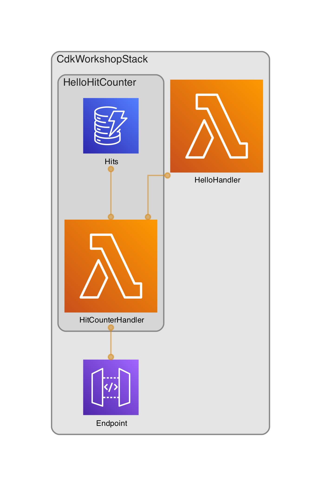

# Welcome to your CDK TypeScript project

You should explore the contents of this project. It demonstrates a CDK app with an instance of a stack (`CdkWorkshopStack`)
which contains an Amazon SQS queue that is subscribed to an Amazon SNS topic.

The `cdk.json` file tells the CDK Toolkit how to execute your app.

## Useful commands

* `npm run build`   compile typescript to js /* typescript を js にコンパイルする */
* `npm run watch`   watch for changes and compile /* 変更を監視してコンパイルする */
* `npm run test`    perform the jest unit tests /* jest単体テストを実行する */
* `cdk run draw`    create an App structure image with draw.io /* draw.io で アプリ構造イメージを作成する */
* `cdk deploy`      deploy this stack to your default AWS account/region /* このスタックをデフォルトの AWS アカウント / リージョンにデプロイします */
* `cdk diff`        compare deployed stack with current state /* デプロイされたスタックを現在の状態と比較する */
* `cdk synth`       emits the synthesized CloudFormation template /* 合成された CloudFormation テンプレートを発行します */

## structure

<table>
    <tr>
        <td>
            
        </td>
        <td>
            
lambda で 実装した API を APIGateway で 公開する. 
                <a href="https://zvikxhonn6.execute-api.ap-northeast-1.amazonaws.com/prod/" target="_blank" rel="noopener noreferrer">
                    こちらのURL
                </a>
                からお試しできる。
            

        </td>
    </tr>
</table>
